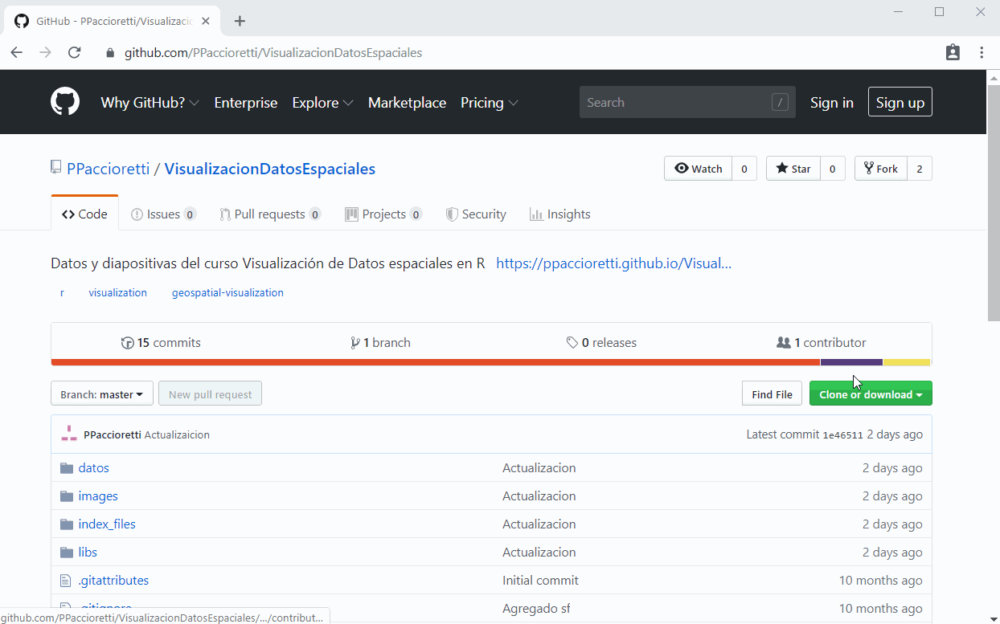
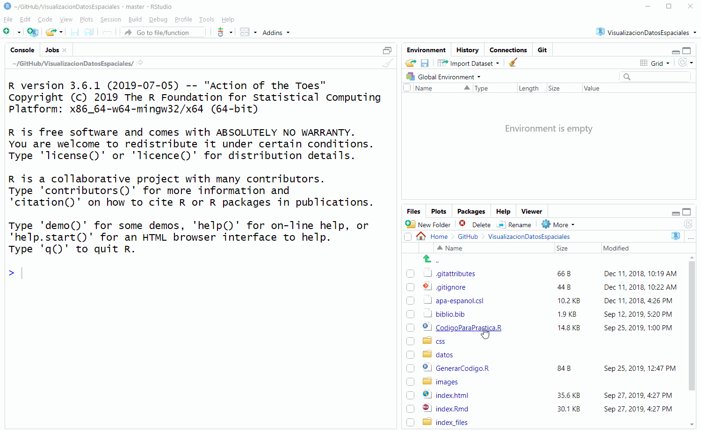
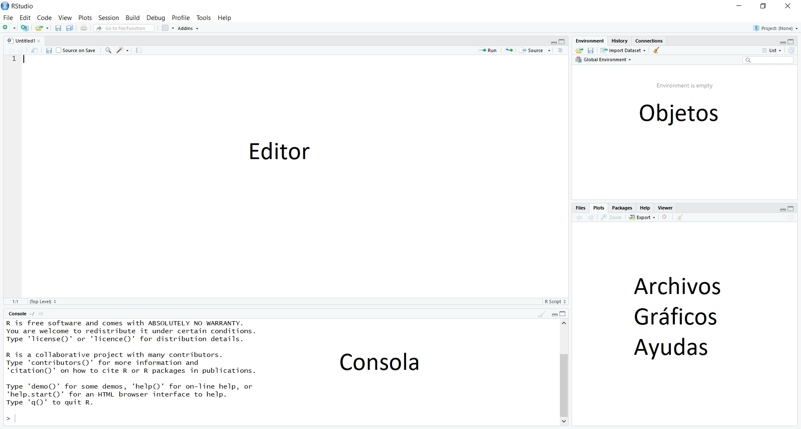
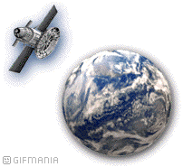

```{r setup, include=FALSE, purl = FALSE}
knitr::opts_chunk$set(echo = TRUE, fig.align = "center", fig.retina = 3, rows.print = 7)
library(sf)
library(ggplot2)
library(ggmap)
library(prettymapr)
library(units)
library(tmap)
library(leaflet)
library(leafem)
library(ggspatial)
library(ggsn)

library(xaringanthemer)
library(servr)
library(RefManageR)
# rmarkdown::yaml_front_matter(knitr::current_input())


knitr::knit_hooks$set(
   error = function(x, options) {
     paste('\n\n<div class="alert alert-danger" style="background-color:#ffb3b3">',
           gsub('##', '\n', gsub('^##\ Error', '<strong>Error</strong>', x)),
           '</div>', sep = '\n')
   },
   warning = function(x, options) {
     paste('\n\n<div class="alert alert-warning" style="background-color:#ffff66">',
           gsub('##', '\n', gsub('^##\ Warning:', '**Warning**', x)),
           '</div>', sep = '\n')
   }
)


BibOptions(check.entries = FALSE, bib.style = "authoryear", style = "markdown",
           dashed = TRUE, hyperlink = FALSE, max.names = 2)
bib <- ReadBib("biblio.bib")

duo_accent(primary_color = "#006747", secondary_color = "#1d5357", 
           text_font_family = google_font(family = "Work Sans", languages = c("latin-ext")),
           code_font_family = google_font(family = "Inconsolata", languages = c("latin-ext")),
           text_font_size = "30px", code_highlight_color = "#a3c8ff",
           link_color = "#ff1fad",
           outfile = "css/xaringan-themer.css")
options(width = 80, scipen = 99, sf_max_print = 3)
options(htmltools.dir.version = FALSE)

# servr::daemon_stop(1)
# xaringan::inf_mr()
# install.packages("revealjs")
```


```{r cargaLibrerias, echo=FALSE, include=FALSE}
# Esto es un comentario
# Esta es otra linea de comentario
# ahora vamos a sumar
2 + 2

#Y podemos almacenar un resultado en un objeto
resultado <- 2 + 2
# para verlo tenemos que "llamar" a ese objeto
resultado


#Instalemos y carguemos paquetes especializados
libs <- c("sf","units", "prettymapr","tmap", "leaflet","leafem",
           "ggplot2","ggmap","ggsn","ggspatial")

new.packages <- libs[!(libs %in% rownames(installed.packages()))]
if(length(new.packages)) install.packages(new.packages)

invisible(sapply(libs, library,character.only = T, quietly=T))

```


class: title-slide

.my-logo-right[]

.titulo[
#Visualización de Datos Espaciales en R
]

.subtitulo[
## XXIV Reunión Científica del Grupo Argentino de Biometría
]

.autores[
 Dra. Cecilia Bruno <br>
 Ing. Agr. Pablo Paccioretti
]

`r icon::fa('paper-plane')` cebruno@agro.unc.edu.ar
<br>
`r icon::fa('paper-plane')` pablopaccioretti@agro.unc.edu.ar

.small[Facultad de Ciencias Agropecuarias - UNC - CONICET]

.tleft[`r format(Sys.Date(), '%B %Y')`]

---


## Temas

1. Introducción a R
1. Manejo de datos espaciales con `sf`
    + Lectura de archivos de diferentes formatos
        - Geopackage
        - Shapefile
        - Base de datos de texto (*data frame*)
    + Manejo de objetos `sf`
    + Proyección y reproyección
1. Visualización para comunicación de resultados
    + Paquete `ggplot2`
    + Paquete `tmap`
1. Visualización interactiva
    + Paquete `leaflet`

---
class: inverse, middle, center

# `r icon::fa(name = "github")`

# Esta presentación y los datos están disponibles en

[https://github.com/PPaccioretti/VisualizacionDatosEspaciales](https://github.com/PPaccioretti/VisualizacionDatosEspaciales)


---

# GitHub

- GitHub es una plataforma de desarrollo colaborativo para alojar proyectos utilizando el sistema de control de versiones Git

- El código de los proyectos alojados en GitHub se almacena típicamente de forma pública

- En 2018, Microsoft compró GitHub por 7.500 millones de dólares

---

```{r, echo = FALSE, out.width = "84%", purl = FALSE}

```

---

Una vez descargado, lo extraemos en una carpeta.
Abrimos con RStudio el proyecto llamado **VisualizaciónDatosEspaciales.Rproj**


.left-column[.center-left[
### Links de descarga

- [`r icon::fa("r-project")`](https://cran.r-project.org/)
- [RStudio](https://www.rstudio.com/products/rstudio/download/#download)

]]

.right-column[

```{r, echo = FALSE, out.width = "85%", purl = FALSE}

```

]

---

## Interfaz de RStudio


```{r, echo = FALSE, out.width = "80%", purl = FALSE }

```

---

## Sintaxis

+ Los `#` indican comentarios en el código, todo lo que está a la derecha de este símbolo no será ejecutado.
+ Si deseamos guardar un resultado de una función en un objeto, debemos utilizar la función de asignación `<-`.
+ Argumentos de una functión se especifican entre paréntesis y están separados por coma: `NombreFuncion(arg1, arg2)`.
+ R distingue mayúsculas y minúsculas.
+ Caracteres especiales (espacios, tildes, signos) son reemplazados por . en nombres de columnas.
+ Se recomienda evitar el uso de tildes, ñ, símbolos matemáticos para nombres de los niveles de factores, columnas y objetos.

---

## Ejemplo de código

```{r}
2+2
normalAleatorio <- rnorm(10, mean = 0, sd = 1)
normalAleatorio

```

---

class: inverse, middle, center

# Datos espaciales

---

# R-espacial
- Hay numerosos paquetes para el manejo de datos espaciales `geoR`, `sp`, `gstat`, `rgdal`, `spdep`, `sf`, `stars`, `raster`, entre otros.
- Los primeros procedimientos espaciales de R se originaron en el lenguaje S, en la década del 90 `r Cite(bib, "bivand_implementing_2000")`.
- A partir del 2000, R ofrece paquetes que posibilitan el tratamiento de datos espaciales a través de diversos métodos. Algunos de ellos todavía se utilizan.
- El paquete `sf` se basa en su predecesor `sp`.


---

# Datos espaciales en R

+ Los datos vectoriales, usando puntos, líneas y polígonos, permiten representar superficies `r icon::fa("globe-americas")`
+ Los datos tipo *raster* divide la superficie en celdas (pixeles) de tamaño constante `r icon::fa("th")`


```{r, echo = FALSE, out.width = "20%", purl = FALSE}

```


---

# Paquete `sf`

*Simple features* es una manera estandarizada de codificar, en computadoras, datos **vectoriales** (puntos `r icon::fa("ellipsis-h")`, lineas `r icon::fa("star-of-life")` y polígonos `r icon::fa("draw-polygon")`)

El paquete `sf` implementa *simple features* en R y conserva las mismas capacidades para el manejo de datos vectoriales como los paquetes `sp`, `rgeos` y `rgdal` `r Cite(bib, "Pebesma_RJ")`

El manejo de objetos espaciales se convirtió en un proceso más simple y acorde a la lógica de programación de R

---

# Paquete `sf`


- El paquete `sf` permite el análisis y el manejo de archivos con datos espaciales
--

- Los objetos espaciales `sf` están almacenados como `data.frame`, donde los datos geográficos ocupan una columna especial (*geometry list-column*)
--

- A partir de un objeto `sf` se puede obtener un `data.frame`, el cual tendrá una columna del tipo lista con la posición geográfica
--

- Las funciones del paquete comienzan con `st_`
--

- Los objetos espaciales `sf` pueden ser tratados como `data.frame` en la mayoría de las operaciones


???
- Tipos de objetos espaciales (Vectorial, Raster)
- Lectura de diferentes tipos de archivos
- Asignación del sistema de coordenadas
    + Transformacion de cordenadas
- Separar las coordenadas de los datos
- Recortar capas en función de otra
- Herramientas para el manejo de objetos
    + Media, mediana de valores de punto dentro de poligono
    + Conteo de puntos dentro de un poligono
    + Union puntos, union diferentes capas


---

# Paquete `raster`
- Es compatible con objetos de tipo *raster* en R
- Provee numerosas funciones para crear, leer, exportar, manipular y procesar datos de tipo *raster*
- Permite trabajar con *raster* de dimensiones muy grandes para ser almacenados en la memoria RAM
- Cada celda del archivo *raster*, puede contener un único valor (numérico o categórico)
- Se pueden agrupar más de una capa en un mismo *raster*


???
En vez de cargar todo el *raster* en la memoria RAM, tiene la posibilidad de dividirlo en fragmentos más pequeños y procesarlos de manera iterativa.

---

# Sistemas de referencia de coordenadas

- Define cómo los elementos espaciales de los datos se relacionan con la superficie terrestre
- Pueden ser
    + Sistemas de coordenadas geográficas: Identifica cualquier punto de la superficie terrestre utilizando dos valores: Latitud y Longitud (*lat long*)
    + Proyecciones de sistemas de coordenadas de referencia: Basados en coordenadas Cartesianas en una superficie plana (Ejemplo *UTM*)

.center[
```{r, echo = FALSE, out.width = "34%", purl = FALSE }
knitr::include_graphics("images/Proyecciones.gif")
```
]

---

layout: false
class: inverse, middle, center

# Manos a la obra

## `r icon::fa("laptop-code")`


---

# Lectura de archivos `r icon::fa("database")`

- Desde un archivo *Shapefile* (.shp) (Cuencas de la Provincia de Córdoba)
- Desde un archivo *GeoPackage* (.gpkg) (Departamentos de la Provincia de Córdoba)
- Desde archivo de *texto* (Muestreo de Suelo de la Provincia de Córdoba)


---


# Lectura de archivo *Shapefile*

*Shapefile* consisten en varios archivos de datos espaciales, con el mimso nombre base que residen en el mismo directorio. Fue desarrollado por la compañía ESRI.

Los archivos obligatorios son:

- **.shp**: es el archivo principal que almacena la geometría de la entidad
- **.shx**: es el archivo de índice que almacena el índice de la geometría de la entidad
- **.dbf**: es la tabla dBASE que almacena la información de atributos de las entidades

--

Pero pueden tener otros tipos de archivos

**.prj**, **.xml**, **.sbn**, **.sbx** ....


???

- **.prj**: es el archivo que almacena información del sistema de coordenadas
- **.xml**: metadatos de ArcGIS, es el archivo que almacena información sobre el shapefile
- **.sbn** y **.sbx**: son los archivos que almacenan el índice espacial de las entidades
- **.fbn** y **.fbx**: son los archivos que almacenan el índice espacial de las entidades para los shapefiles que son solo de lectura.
- **.ain** y **.aih**: son los archivos que almacenan el índice de atributo de los campos activos en una tabla o una tabla de atributos del tema.
- **.atx**: se crea un archivo .atx para cada shapefile o índice de atributos de shapefile dBase creado en ArcCatalog. ArcGIS no utiliza los índices de atributo de ArcView GIS 3.x de los archivos shapefile y dBase. Se ha creado un nuevo modelo de indexación de atributos para los archivos shapefile y dBase.
- **.ixs**: índice de geocodificación para los shapefiles de lectura y escritura.
- **.mxs**: índice de geocodificación para los shapefiles de lectura y escritura (formato ODB).
- **.cpg**: es un archivo opcional que se puede utilizar para especificar la página de código para identificar el conjunto de caracteres que se va a utilizar.

---

# Vectoriales

```{r, highlight.output=c(1,2,6,9)}
print(departamentos <- read_sf("datos/deptos_cba", stringsAsFactors = TRUE), n = 3)
```

---

```{r}
summary(departamentos)
```

---


```{r}
plot(departamentos)
```


???

Visualizamos las capas con la función `plot`

---


.left-column[.center-left[<br>
```{r, eval=FALSE}
?plot.sf()
```
]]

.right-column[.center-right[
```{r}
plot(departamentos["departa"])
```
]]


???

Si queremos sacar la leyenda?

---

```{r}
plot(departamentos["departa"], key.pos = NULL)
```

???

Podemos cambiar el titulo

---

```{r}
plot(departamentos["departa"], key.pos = NULL, main = "Departamentos")
```

---

# Lectura de archivo *GeoPackage*

- *GeoPackage* es un formato de archivo universal construido sobre la base de SQLite, para compartir y transferir datos espaciales vectoriales **y** raster.
- A diferencia de los *shapesfiles*, se trata de un único archivo **.gpkg**, por lo que es ideal para transferir información geoespacial
- Se ha diseñado para almacenar datos complejos y voluminosos (hasta 140 TB)
- Permite almacenar diferentes tipos de geometrías en un mismo archivo: Point, Line, Polygon, MultiPoint, MultiLine, MultiPolygon, CompoundCurve, CurvedPolygon, MultiCurve y MultiSurface
- GeoPackage destaca por su flexibilidad y se puede utilizar de muchas maneras, por lo que puede reemplazar al formato shapefile


---


## Ahora visualicemos `cuencas`

```{r}
print(cuencas <- read_sf("datos/cuencas_cba/cuencas_cba.gpkg", stringsAsFactors = TRUE), n = 2)

```


---

```{r}
summary(cuencas, maxsum = 3)
```

---


```{r, fig.height=7.5}
plot(cuencas)
```


---


.pull-left[

```{r}
plot(departamentos["departa"],
     main = NULL, col = "transparent")
```

]

.pull-right[

```{r}
plot(cuencas["AREA"],
     main = NULL, col = "transparent")
```

]


---

## Si queremos ver superpuestas ambas capas?

```{r plot-plotSinEstarJuntos, fig.height=5.5, results='hide', fig.show = 'hide'}
plot(departamentos["departa"], col = "transparent", main = NULL,
     reset = FALSE) #<<
plot(cuencas["AREA"], col = "transparent",
     add = TRUE) #<<
```


```{r ref.label = 'plot-plotSinEstarJuntos', fig.height=5.2, echo = FALSE, warning=FALSE, message=FALSE}
```

--

.abajo[
```{r, echo = FALSE, out.width = "40%", purl = FALSE }

```
]

---

```{r, highlight.output=c(3)}
st_crs(departamentos)
```

```{r, highlight.output=c(3)}
st_crs(cuencas)
```

```{r}
st_crs(departamentos) == st_crs(cuencas)

```

---

```{r, highlight.output=c(3)}
cuencas <- st_transform(cuencas, st_crs(departamentos))
st_crs(cuencas)
```

```{r}
st_crs(departamentos) == st_crs(cuencas)
```

---

```{r, highlight.output=c(5, 6)}
print(cuencas, n = 4)
```

---


```{r}
plot(departamentos["departa"], col = "transparent", main = NULL, reset = FALSE)
plot(cuencas["AREA"], col = "transparent", add = TRUE)

```

--

.abajo[
```{r, echo = FALSE, out.width = "40%", purl = FALSE }

```
]

---

```{r}
plot(departamentos["departa"], col = "transparent", main = NULL, reset = FALSE)
plot(cuencas["AREA"], col = "transparent", add = TRUE, border = "red")
```

---

```{r, fig.height = 5.3}
plot(departamentos["departa"], col = "transparent", main = NULL, reset = FALSE)
plot(cuencas["AREA"], col = "transparent", add = TRUE, border = "red")
legend("bottomright", legend = c("Límites departamentales", "Cuencas"), col = c("black", "red"), lty = 1, lwd = 3)
```

---

```{r, fig.height=5.2}
plot(departamentos["departa"], col = "transparent", main = NULL, reset = FALSE)
plot(cuencas["AREA"], col = "transparent", add = TRUE, border = "red")
legend("bottomright", legend = c("Límites departamentales", "Cuencas"), col = c("black", "red"), lty = 1, lwd = 3)
prettymapr::addnortharrow()

```

---

```{r plot-departamentos, results='hide', fig.show = 'hide'}
plot(departamentos["departa"], col = "transparent", main = NULL, reset = FALSE)
plot(cuencas["AREA"], col = "transparent", add = TRUE, border = "red")
legend("bottomright", legend = c("Límites departamentales", "Cuencas"), col = c("black", "red"), lty = 1, lwd = 3)
prettymapr::addnortharrow()
prettymapr::addscalebar()
```

---

```{r ref.label = 'plot-departamentos', echo = FALSE, warning=FALSE, message=FALSE}
```

---


```{r plot-prettyCm, results='hide', fig.show = 'hide'}
prettymap(plot(departamentos["departa"],
               col = "transparent",
               main = "Departamentos"),
          drawarrow=TRUE)

```

---

.left-column[

La escala está en centímetros!

.center[ 

`r icon::fa('frown')`

]

]

.right-column[

```{r ref.label = 'plot-prettyCm', echo = FALSE, warning=FALSE, message=FALSE}
```

]


---


```{r plot-prettyKm, results='hide', fig.show = 'hide', fig.height=5.5, fig.width=3}
prettymap(plot(departamentos["departa"],
               col = "transparent",
               main = "Departamentos"),
          drawarrow=TRUE,
          scale.plotepsg = 4326) #<<

```

---

.left-column[

.center[`r icon::fa("laugh-beam")`]

]

.right-column[
```{r ref.label = 'plot-prettyKm', echo = FALSE, warning=FALSE, message=FALSE, purl = FALSE}
```

]

---

# Mapa de fondo

```{r, seteoBordes, eval = TRUE}
bordes <- st_bbox(cuencas)
names(bordes) <- c("left", "bottom", "right", "top")
```


```{r, plot-descargaGraficaMapa, eval = TRUE, warning=TRUE, fig.show = 'hide', error = TRUE, message=FALSE, cahe = TRUE}
Mapa <- get_stamenmap(bbox = bordes, zoom = 2)

```


```{r, eval = FALSE}
try(plot(cuencas["AREA"], axes = TRUE, bgMap= Mapa))
```


---

```{r plot-mapaDeFondo, eval = TRUE, fig.show = 'hide'}
cuencas <- st_transform(cuencas, crs = st_crs(3857))
plot(cuencas["AREA"], axes = TRUE, bgMap= Mapa)
```

---


```{r, echo = FALSE, warning=FALSE, message=FALSE}
cuencas <- st_transform(cuencas, crs = st_crs(3857))
plot(cuencas["AREA"], axes = TRUE, col = "transparent", bgMap= Mapa)
addnortharrow()
addscalebar()
```


---
# Lectura de archivo de texto

```{r}
muestreo <- read.table("datos/MuestreoSuelo.txt", header = T, sep = "\t")
```

```{r, eval = FALSE, echo=FALSE}
muestreo
```

```{r, purl=FALSE, echo = FALSE}
DT::datatable(muestreo, fillContainer = TRUE)
```

---

```{r}
print(muestreo <- st_as_sf(muestreo, coords = c("Xt", "Yt"), crs = 32720), n = 5)

```


---


```{r}
summary(muestreo)
```

---


.pull-left[


```{r, fig.height = 8.5, fig.width = 13}
plot(muestreo, pch = 18 , cex = 3)
```

]

.pull-right[

```{r}

ggplot(muestreo) +
  geom_sf()

```


]


---


```{r}
ggplot(muestreo) +
  geom_sf(aes(fill = Limo), shape = 22, size = 3)

```


---


```{r}

ggplot(muestreo) +
  geom_sf(aes(fill = Limo), shape = 22, size = 3) +
  geom_sf(data = departamentos)

```

---


```{r}
ggplot(muestreo) +
  geom_sf(data = departamentos) +
  geom_sf(aes(fill = Limo), shape = 22, size = 3) 
 
```


---

# Librería `ggplot2`

Idividualmente se especifican partes del gráfico. Luego estas partes se combinan para obtener el gráfico completo. Estas partes son:

- Datos
- Mapeo estético (*aesthetic mapping*)
- Objetos geométricos (*geometric object*)
--

- Transformaciones estadísticas (*statistical transformations*)
- Escalas (*scales*)
- Sistema de coordenadas (*coordinate system*)
- Ajustes de posición (*position adjustments*)
- Particiones (*faceting*)

---


.pull-left[


```{r}
ggplot() 
```

]

.pull-right[


```{r}
ggplot() +
  geom_sf(data = cuencas)
```

]


---


.pull-left[


```{r}
ggplot() +
  geom_sf(data = cuencas) +
  geom_sf(data = muestreo)
```

]

.pull-right[

```{r, fig.height=5.5}
ggCuencasMuestero <- ggplot() +
  geom_sf(data = cuencas) +
  geom_sf(data = muestreo, aes(color = Limo), size = 3) 
ggCuencasMuestero
```

]

---


.pull-left[


```{r ggplot-cuencasMuestreo, fig.show = 'hide'}
ggCuencasMuestero + #<<
  scale_color_continuous(type = "viridis")
```

]

.pull-right[

```{r, ref.label='ggplot-cuencasMuestreo', echo = FALSE, warning=FALSE, message=FALSE}
```

]

---


.pull-left[


```{r ggplot-cuencasMuestNA, fig.show = 'hide'}

ggCuencasMuestero + #<<
  scale_color_continuous(type = "viridis", na.value = "pink")

```

]

.pull-right[

```{r ref.label = 'ggplot-cuencasMuestNA', echo = FALSE, warning=FALSE, message=FALSE, purl = FALSE}
```

]

---

# Cuantos puntos de muestreo hay en cada cuenca??? `r icon::fa("pencil-ruler")`


```{r, error=TRUE}
muestreoLatLong <- st_transform(muestreo, st_crs(departamentos))
st_covers(cuencas, muestreoLatLong)
```


```{r, results='markup'}
cuencasUTM <- st_transform(cuencas, st_crs(muestreo))
lengths(st_covers(cuencasUTM, muestreo))

```


---


```{r}
st_area(cuencas)
lengths(st_covers(cuencasUTM, muestreo))/st_area(cuencasUTM)

```

---


```{r}
puntosKm <- lengths(st_covers(cuencasUTM, muestreo))/units::set_units(st_area(cuencasUTM), km^2)
cuencasUTM$CantidadMuestrasKm <- puntosKm
cuencasUTM$CantidadMuestrasKm
```

---


```{r}
plot(cuencasUTM["CantidadMuestrasKm"])
```


---


```{r}
st_covers(cuencasUTM,muestreo)

```


---


```{r, highlight.output=c(1,2,3)}
 mediaLimo <- sapply(st_covers(cuencasUTM,muestreo), function(x) {
  mean(muestreo[x,][["Limo"]], na.rm = TRUE)
     })
mediaLimo


```


---


.pull-left[


```{r ggplot-cuencasMediaLimo, fig.show = 'hide'}
cuencasUTM$MediaLimo <- mediaLimo
ggplot(cuencasUTM) +
  geom_sf(aes(fill = MediaLimo))

```

]

.pull-right[

```{r ref.label = 'ggplot-cuencasMediaLimo', echo = FALSE, warning=FALSE, message=FALSE, purl = FALSE}
```

]


---


.pull-left[


```{r ggplot-cuencasMediaLimolab, fig.show = 'hide'}
ggplot(cuencasUTM) +
  geom_sf(aes(fill = MediaLimo)) +
  labs(fill = "Limo (%)")

```

]

.pull-right[

```{r ref.label = 'ggplot-cuencasMediaLimolab', echo = FALSE, warning=FALSE, message=FALSE, purl = FALSE}
```

]


---
.pull-left[


```{r, fig.height=5}
ggplot(cuencasUTM) +
  geom_sf(aes(fill = MediaLimo)) +
  labs(fill = "Limo (%)") + 
  ggsn::scalebar(cuencasUTM, dist = 50, transform = FALSE, dist_unit = "km")


```

]

.pull-right[

```{r, fig.height=5}

ggplot(cuencasUTM) +
  geom_sf(aes(fill = MediaLimo)) +
  labs(fill = "Limo (%)") + 
  ggsn::scalebar(cuencasUTM, dist = 50, transform = FALSE, dist_unit = "km") + 
  ggspatial::annotation_north_arrow(location = "tr", which_north = "grid")

```

]


---

.pull-left[
```{r}
tm_shape(cuencasUTM) +
  tm_fill()

```
]


.pull-right[
```{r tmap-cuencasMediaLimoSB}
tm_shape(cuencasUTM) +
  tm_fill("MediaLimo")

```

]


---

# Paquete `tmap`

- La sintaxis es similar a `ggplot2`, pero orientada a mapas
- La mayoría de las funciones comienzan con `tm_`
- Para comenzar a graficar, es necesario especificarlo con `tm_shape`
- Las capas se agregan mediante `+`
- Permite graficar mapas estáticos o interactivos con el mismo código `tmap_mode()`.


---


.pull-left[


```{r tmap-cuencasMediaLimo, fig.show = 'hide'}
tm_shape(cuencasUTM) +
  tm_fill("MediaLimo") +
  tm_borders()

```

]

.pull-right[

```{r ref.label = 'tmap-cuencasMediaLimo', echo = FALSE, warning=FALSE, message=FALSE, purl = FALSE}
```

]


---


.pull-left[
```{r}
tm_shape(cuencasUTM) +
  tm_fill("MediaLimo", style = "quantile") +
  tm_borders() 
```

]

.pull-right[

```{r}
tm_shape(cuencasUTM) +
  tm_fill("MediaLimo", style = "cont") +
  tm_borders() 
```


]


---


.pull-left[


```{r tmap-cuencasMediaLimoContInterac, fig.show = 'hide', results = 'hide'}
tmap_mode("view")
tm_shape(cuencasUTM) +
  tm_fill("MediaLimo", style = "cont") +
  tm_borders() +
  tm_basemap("Esri.WorldTopoMap")


```

]

.pull-right[

```{r ref.label = 'tmap-cuencasMediaLimoContInterac', echo = FALSE, warning=FALSE, message=FALSE}
```

]


---


.pull-left[


```{r tmap-cuencasMediaLimoquantInteracFondo, fig.show = 'hide', results = 'hide'}
tmap_mode("view")
tm_shape(cuencasUTM) +
  tm_fill("MediaLimo", style = "quantile", alpha = 0.8) +
  tm_borders() +
  tm_basemap(c(
    "Stamen.Watercolor",
    "Esri",
    "OpenTopoMap",
    "Stamen.Terrain")) 
# names(leaflet::providers)
```

]

.pull-right[

```{r ref.label = 'tmap-cuencasMediaLimoquantInteracFondo', echo = FALSE, warning=FALSE, message=FALSE, purl=FALSE}
```

]


---


.pull-left[


```{r tmap-cuencasUTMPllette, fig.show = 'hide', results = 'hide'}
tmap_mode("plot")
cuencas_tmap <- tm_shape(cuencasUTM) +
  tm_fill("MediaLimo", 
          style = "cont", 
          palette = c("red", "blue"),
          textNA = "Sin Datos",
          title.size = "Media Limo") +
  tm_borders() +
  tm_legend(
    text.size=1,
    title.size=1.2,
    legend.outside=TRUE,
    frame="gray50",
    height=.6)
cuencas_tmap #<<

```

]

.pull-right[

```{r ref.label = 'tmap-cuencasUTMPllette', echo = FALSE, warning=FALSE, message=FALSE, purl=FALSE}
```

]


---


.pull-left[


```{r tmap-muestreoNA, fig.show = 'hide', results = 'hide'}
muestreo_tmap <- tm_shape(muestreo) +
  tm_dots("Limo", size = 0.5,
          palette = "BuGn", colorNA= NULL,
          legend.hist=T) +
  tm_layout(legend.format = list(text.separator= " a "),
            legend.outside = TRUE,
            legend.hist.width = 2.5)
muestreo_tmap #<<

```

]

.pull-right[

```{r ref.label = 'tmap-muestreoNA', echo = FALSE, warning=FALSE, message=FALSE, purl=FALSE}
```

]


---


.pull-left[

```{r ref.label = 'tmap-cuencasUTMPllette', echo = FALSE, warning=FALSE, message=FALSE, purl=FALSE}
```

]

.pull-right[

```{r ref.label = 'tmap-muestreoNA', echo = FALSE, warning=FALSE, message=FALSE, purl=FALSE}
```

]


---

.pull-left[

```{r tmap-doscapas, fig.show = 'hide', results = 'hide'}
tm_shape(cuencasUTM) +
  tm_fill("MediaLimo", 
          style = "cont", 
          palette = c("red", "blue"),
          textNA = "Sin Datos",
          title.size = "Media Limo") +
  tm_borders() +
  tm_legend(
    text.size=1,
    title.size=1.2,
    legend.outside=TRUE,
    frame="gray50",
    height=.6) +
  tm_shape(muestreo) +
  tm_dots("Limo", size = 0.5,
          palette = "BuGn", colorNA= NULL,
          legend.hist=T) +
  tm_layout(legend.format = list(text.separator= " a "),
            legend.outside = TRUE,
            legend.hist.width = 2.5)
```

]

.pull-right[

```{r ref.label = 'tmap-doscapas', echo = FALSE, warning=FALSE, message=FALSE, purl=FALSE}
```

]


---

.pull-left[

```{r tmap-dosObjetos, fig.show = 'hide', results = 'hide'}
cuencas_tmap +
muestreo_tmap
```


]

.pull-right[

```{r ref.label = 'tmap-dosObjetos', echo = FALSE, warning=FALSE, message=FALSE, purl=FALSE}
```

]


---


.pull-left[

```{r tmap-escala, fig.show = 'hide', results = 'hide'}
cuencas_tmap +
muestreo_tmap +
  tm_scale_bar() +
  tm_compass(position = c( "right", "top"))

```

]

.pull-right[

```{r ref.label = 'tmap-escala', echo = FALSE, warning=FALSE, message=FALSE, purl=FALSE}
```

]

---


.pull-left[


```{r, fig.height=4.5}
tmap_cuencas <- tm_shape(cuencasUTM) +
  tm_fill("MediaLimo", style = "quantile") +
  tm_borders() +
  tm_legend(legend.outside = TRUE)
tmap_cuencas


```

]

.pull-right[

```{r, fig.height=4.5}
tmap_muestreo <-   tm_shape(muestreo) +
  tm_bubbles(col = "K", style = "cont", textNA = "Sin dato") +
  tm_legend(legend.outside = TRUE)
tmap_muestreo

```

]


---


```{r, fig.width=7}
tmap_arrange(tmap_cuencas, tmap_muestreo)

```


---

```{r}
# tmap_mode("view")
tm_shape(cuencasUTM) +
  tm_fill("MediaLimo", palette="RdYlGn", title.size = "Media Limo") +
  tm_borders() +
  tm_facets("SISTEMA", nrow = 1, sync = TRUE) +
  tm_basemap("OpenStreetMap") +
  tmap_options(limits = c(facets.view = 7))

```


---

```{r}

leaflet() %>%
  addTiles() %>%
  addCircles(data = muestreoLatLong) %>%
  addMiniMap(position = "topleft" , width = 150, height = 150,toggleDisplay = TRUE) 


```

---

```{r}
leaflet() %>%
  addTiles() %>%
  addCircles(data = muestreoLatLong) %>%
  addLogo("https://media.giphy.com/media/l1LcbeAkRm2UrdNio/giphy.gif",
          position = "bottomleft",offset.x = 5, offset.y = 100, width = 480, height = 270)
```

---

# Referencias
.small[
```{r, results='asis', echo = FALSE, purl = FALSE}
PrintBibliography(bib)
```
]

---

layout: false
class: inverse, middle, center

# Muchas Gracias!!!


