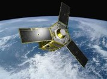

```{r setup, include=FALSE}
knitr::opts_chunk$set(echo = TRUE, fig.align = "center", fig.retina = 3, rows.print = 7)
library(sf)
library(ggplot2)
library(ggmap)
library(prettymapr)
library(units)
library(tmap)
library(leaflet)
library(leafem)
library(xaringanthemer)
library(servr)
library(RefManageR)
library(ggmap)
# rmarkdown::yaml_front_matter(knitr::current_input())


knitr::knit_hooks$set(
   error = function(x, options) {
     paste('\n\n<div class="alert alert-danger" style="background-color:#ffb3b3">',
           gsub('##', '\n', gsub('^##\ Error', '<strong>Error</strong>', x)),
           '</div>', sep = '\n')
   },
   warning = function(x, options) {
     paste('\n\n<div class="alert alert-warning" style="background-color:#ffff66">',
           gsub('##', '\n', gsub('^##\ Warning:', '**Warning**', x)),
           '</div>', sep = '\n')
   }
)


BibOptions(check.entries = FALSE, bib.style = "authoryear", style = "markdown",
           dashed = TRUE, hyperlink = FALSE, max.names = 2)
bib <- ReadBib("biblio.bib")

duo_accent(primary_color = "#006747", secondary_color = "#1d5357", 
           text_font_family = google_font(family = "Work Sans"),
           text_font_size = "30px", code_highlight_color = "#a3c8ff")
options(width = 80, scipen = 99)


libs <- c("sf", "ggmap", "prettymapr", "tmap", "leaflet","leafem", "ggplot2","units")
new.packages <- libs[!(libs %in% rownames(installed.packages()))]
if(length(new.packages)) install.packages(new.packages)

invisible(sapply(libs, library,character.only = T, quietly=T))

# servr::daemon_stop(1)
# xaringan::inf_mr()
# install.packages("revealjs")
```


## Temas

1. Introducción a R
1. Manejo de datos espaciales con `sf`
    + Lectura de archivos de diferentes formatos
        - Shapefile
        - Base de datos de texto (*data frame*)
    + Manejo de objetos `sf`
    + Proyección y reproyección
1. Visualización para comunicación de resultados
    + Paquete `ggplot2`
    + Paquete `tmap`
1. Visualización interactiva
    + Paquete `leaflet`

---
class: inverse, middle, center

# `r icon::fa(name = "github")`

# .fancy[Esta presentación y los datos están disponibles en]


---


## Generalidades de `r icon::fa("r-project")`

- [R](https://cran.r-project.org/) `r Cite(bib, "R-base")` es un lenguaje de programación orientado a objetos.

- Creado por Ross Ihaka y Robert Gentleman en 1993 como un dialecto del software S.

- Puede ser instalado en múltiples plataformas.

- [RStudio](https://www.rstudio.com/products/rstudio/download/#download) `r Cite(bib, "Rstudio")` es un entorno de desarrollo integrado (*Integrated Development Environment* IDE) que facilita la programación.

- R permite realizar estadísticas geoespaciales, modelado y visualización con paquetes especializados.


---


## Interfaz de RStudio


```{r, echo = FALSE, out.width = "80%"}
knitr::include_graphics("images/Rstudiopartes.jpg")
```

---

## Sintaxis

+ Los `#` indican comentarios en el código, todo lo que está a la derecha de este símbolo no será ejecutado.
+ Si deseamos guardar un resultado de una función en un objeto, debemos utilizar la función de asignación `<-`.
+ Argumentos de una functión se especifican entre paréntesis y están separados por coma: `NombreFuncion(arg1, arg2)`.
+ R distingue mayúsculas y minúsculas.
+ Caracteres especiales (espacios, tildes, signos) son reemplazados por . en nombres de columnas.
+ Se recomienda evitar el uso de tildes, ñ, símbolos matemáticos para nombres de los niveles de factores, columnas y objetos.

---

## Ejemplo de código

```{r}
2+2
normalAleatorio <- rnorm(10, mean = 0, sd = 1) 
normalAleatorio
```

---


<!-- layout: false -->
class: inverse, middle, center

# Datos espaciales

---

# R-espacial
- Hay numerosos paquetes para el manejo de datos espaciales `geoR`, `sp`, `gstat`, `rgdal`, `spdep`, `sf`, `stars`, `raster`, entre otros.
- Los primeros procedimientos espaciales de R se originaron en el lenguaje S, en la década del 90 `r Cite(bib, "bivand_implementing_2000")`.
- A partir del 2000, R ofrece paquetes que posibilitan el tratamiento de datos espaciales a través de diversos métodos. Algunos de ellos todavía se utilizan.
- El paquete `sf` se basa en su predecesor `sp`.


---

# Datos espaciales en R

+ Los datos vectoriales, usando puntos, líneas y polígonos, permiten representar superficies `r icon::fa("globe-americas")` 
+ Los datos tipo *raster* divide la superficie en celdas (pixeles) de tamaño constante


> En este curso utilizaremos:  
> - Paquete `sf` para trabajar con archivos vectoriales 
> - Paquete `raster` para trabajar con *rasters*


---

```{r, echo = FALSE, out.width = "10%"}

knitr::include_graphics("images/SateliteTrabajando.gif")


```


---

# Paquete `sf`

*Simple features* es una manera estandarizada de codificar, en computadoras, datos **vectoriales** (puntos, lineas y polígonos) `r icon::fa("draw-polygon")`

El paquete `sf` implementa *simple features* en R y conserva las mismas capacidades para el manejo de datos vectoriales como los paquetes `sp`, `rgeos` y `rgdal` `r Cite(bib, "Pebesma_RJ")`

---

# Paquete `sf`


- El paquete `sf` permite el análisis y el manejo de archivos con datos espaciales
--

- Los objetos espaciales `sf` están almacenados como `data.frame`, donde los datos geográficos ocupan una columna especial (*geometry list-column*)
--

- A partir de un objeto `sf` se puede obtener un `data.frame`, el cual tendrá una columna del tipo lista con la posición geográfica
--

- Las funciones del paquete comienzan con `st_`
--

- Los objetos espaciales `sf` pueden ser tratados como `data.frame` en la mayoría de las operaciones


???
- Tipos de objetos espaciales (Vectorial, Raster)
- Lectura de diferentes tipos de archivos
- Asignación del sistema de coordenadas
    + Transformacion de cordenadas
- Separar las coordenadas de los datos
- Recortar capas en función de otra
- Herramientas para el manejo de objetos
    + Media, mediana de valores de punto dentro de poligono
    + Conteo de puntos dentro de un poligono
    + Union puntos, union diferentes capas 
 


---

# Paquete `raster`
- Es compatible con objetos de tipo *raster* en R
- Provee numerosas funciones para crear, leer, exportar, manipular y procesar datos de tipo *raster*
- Permite trabajar con *raster* de dimensiones muy grandes para ser almacenados en la memoria RAM
- Cada celda del archivo *raster*, puede contener un único valor (numérico o categórico)
- Se pueden agrupar más de una capa en un mismo *raster*


???
En vez de cargar todo el *raster* en la memoria RAM, tiene la posibilidad de dividirlo en fragmentos más pequeños y procesarlos de manera iterativa.

---

# Sistemas de referencia de coordenadas

- Define cómo los elementos espaciales de los datos se relacionan con la superficie terrestre
- Pueden ser
    + Sistemas de coordenadas geográficas: Identifica cualquier punto de la superficie terrestre utilizando dos valores: Latitud y Longitud (*lat long*)
--
    + Proyecciones de sistemas de coordenadas de referencia: Basados en coordenadas Cartesianas en una superficie plana (*UTM*)


---
layout: false
class: inverse, middle, center

# Manos a la obra

## `r icon::fa("laptop-code")`

---

# Lectura de archivos

  + Vectoriales
      - shp (departamentos y cuencas de la Provincia de Córdoba)
      - desde archivo de texto (Muestreo de Suelo de la Provincia)
  + Raster
      - tif (DEM)
  
  .center[`r icon::fa("globe", size = 2.3)` ]

---
# Vectoriales

```{r, highlight.output=c(1,2,6,9)}
head(departamentos <- read_sf("datos/deptos_cba", stringsAsFactors = TRUE), 3)
```


---

```{r}
summary(departamentos)
```

---

<!-- # Visualicemos la capa -->

```{r}
plot(departamentos)
```


???

Visualizamos las capas con la función `plot`

---


.left-column[.center-left[<br>
```{r, eval=FALSE}
?plot.sf()
```
]]

.right-column[.center-right[
```{r}
plot(departamentos["departa"])
```
]]


???

Si queremos sacar la leyenda?

---

```{r}
plot(departamentos["departa"], key.pos = NULL)
```

??? 

Podemos cambiar el titulo

---

```{r}
plot(departamentos["departa"], key.pos = NULL, main = "Departamentos")
```

---

## Ahora visualicemos `cuencas`

```{r}
head(cuencas <- read_sf("datos/cuencas_cba", stringsAsFactors = TRUE), 2)

```


---

```{r}
summary(cuencas)
```

---


```{r, fig.height=5.5}
plot(cuencas)
```


---


.pull-left[

```{r}
plot(departamentos["departa"], 
     main = NULL, col = "transparent")
```

]

.pull-right[

```{r}
plot(cuencas["AREA"], 
     main = NULL, col = "transparent")
```

]


---

## Si queremos ver superpuestas ambas capas?


```{r, fig.height=5.5}
plot(departamentos["departa"], col = "transparent", main = NULL, 
     reset = FALSE) #<<
plot(cuencas["AREA"], col = "transparent", add = TRUE)

```

---

```{r, highlight.output=c(3)}
st_crs(departamentos)
```

```{r, highlight.output=c(3)}
st_crs(cuencas)
```

```{r}
st_crs(departamentos) == st_crs(cuencas)

```

---

```{r, highlight.output=c(3)}
cuencas <- st_transform(cuencas, st_crs(departamentos))
st_crs(cuencas)
```

```{r}
st_crs(departamentos) == st_crs(cuencas)
```

---

```{r, highlight.output=c(5, 6)}
head(cuencas,4)
```

---


```{r}
plot(departamentos["departa"], col = "transparent", main = NULL, reset = FALSE)
plot(cuencas["AREA"], col = "transparent", add = TRUE)

```


---

```{r}
plot(departamentos["departa"], col = "transparent", main = NULL, reset = FALSE)
plot(cuencas["AREA"], add = TRUE, col = "transparent", border = "red")
```

---

```{r, fig.height = 5.3}
plot(departamentos["departa"], col = "transparent", main = NULL, reset = FALSE)
plot(cuencas["AREA"], add = TRUE, col = "transparent", border = "red")
legend("bottomright", legend = c("Límites departamentales", "Cuencas"), col = c("black", "red"), lty = 1, lwd = 3)
```

---

```{r, fig.height=5.2}
plot(departamentos["departa"], col = "transparent", main = NULL, reset = FALSE)
plot(cuencas["AREA"], add = TRUE, col = "transparent", border = "red")
legend("bottomright", legend = c("Límites departamentales", "Cuencas"), col = c("black", "red"), lty = 1, lwd = 3)
prettymapr::addnortharrow()

```

---

```{r plot-departamentos, results='hide', fig.show = 'hide'}
plot(departamentos["departa"], col = "transparent", main = NULL, reset = FALSE)
plot(cuencas["AREA"], add = TRUE, col = "transparent", border = "red")
legend("bottomright", legend = c("Límites departamentales", "Cuencas"), col = c("black", "red"), lty = 1, lwd = 3)
prettymapr::addnortharrow()
prettymapr::addscalebar()
```

---

```{r ref.label = 'plot-departamentos', echo = FALSE, warning=FALSE, message=FALSE}
```

---


```{r plot-prettyCm, results='hide', fig.show = 'hide'}
prettymap(plot(departamentos["departa"],
               col = "transparent", 
               main = "Departamentos"), 
          drawarrow=TRUE)

```

---

.left-column[ 
La escala está en centímetros!

.center[`r icon::fa("frown")`]

]

.right-column[ 

```{r ref.label = 'plot-prettyCm', echo = FALSE, warning=FALSE, message=FALSE}
```

]


---


```{r plot-prettyKm, results='hide', fig.show = 'hide'}
prettymap(plot(departamentos["departa"],
               col = "transparent", 
               main = "Departamentos"), 
          drawarrow=TRUE, 
          scale.plotepsg = 4326) #<<

```

---

.left-column[ 

.center[`r icon::fa("laugh-beam")`]

]

.right-column[ 
```{r ref.label = 'plot-prettyKm', echo = FALSE, warning=FALSE, message=FALSE}
```

]

---

# Mapa de fondo

```{r, seteoBordes, eval = TRUE}
bordes <- st_bbox(cuencas)
names(bordes) <- c("left", "bottom", "right", "top")
```


```{r, plot-descargaGraficaMapa, eval = TRUE, warning=TRUE, fig.show = 'hide', error = TRUE, message=FALSE, cahe = TRUE}
Mapa <- get_stamenmap(bbox = bordes, zoom = 2)

```


```{r, eval = FALSE}
try(plot(cuencas["AREA"], axes = TRUE, bgMap= Mapa))
```


---

```{r plot-mapaDeFondo, eval = TRUE, fig.show = 'hide'}
cuencas <- st_transform(cuencas, crs = st_crs(3857))
plot(cuencas["AREA"], axes = TRUE, bgMap= Mapa)
```

---


```{r, echo = FALSE, warning=FALSE, message=FALSE}
cuencas <- st_transform(cuencas, crs = st_crs(3857))
plot(cuencas["AREA"], axes = TRUE, bgMap= Mapa)
addnortharrow()
addscalebar()
```


---
# Lectura de archivo de texto

```{r}
head(muestreo <- read.table("datos/MuestreoSuelo.txt", header = T, sep = "\t"),8)
```

---

```{r}
head(muestreo <- st_as_sf(muestreo, coords = c("Xt", "Yt"), crs = 32720), 5)

```

---


```{r}

muestreoLatLong <- st_transform(muestreo, st_crs(departamentos))
plot(departamentos["departa"], col = "transparent", reset = FALSE)
plot(muestreoLatLong["Limo"], add = TRUE)


```


---


```{r}
summary(muestreo)
```

---


```{r, fig.height = 8.5, fig.width = 13}
plot(muestreo, pch = 18 , cex = 3)
```

---
# Librería `ggplot2`

Idividualmente se especifican partes del gráfico. Luego estas partes se combinan para obtener el gráfico completo. Estas partes son:

- Datos
- Mapeo estético (*aesthetic mapping*)
- Objetos geométricos (*geometric object*)
--

- Transformaciones estadísticas (*statistical transformations*)
- Escalas (*scales*)
- Sistema de coordenadas (*coordinate system*)
- Ajustes de posición (*position adjustments*)
- Particiones (*faceting*)

---


.pull-left[ 


```{r ggplot-cuencas, fig.show = 'hide'}
ggplot(cuencas) +
  geom_sf() 
```

]

.pull-right[ 
```{r ref.label = 'ggplot-cuencas', echo = FALSE, warning=FALSE, message=FALSE}
```

]


---


.pull-left[ 


```{r ggplot-cuencasMuestreo, fig.show = 'hide'}

ggCuencasMuestero <- ggplot() +
  geom_sf(data = cuencas) +
  geom_sf(data = muestreo, 
          aes( color = Limo), size = 3)


```

]

.pull-right[ 

```{r, echo = FALSE, warning=FALSE, message=FALSE}
ggCuencasMuestero
```

]

---


.pull-left[ 


```{r ggplot-cuencasMuestNA, fig.show = 'hide'}

ggCuencasMuestero + #<<
  scale_color_continuous(na.value = "red")

```

]

.pull-right[ 

```{r ref.label = 'ggplot-cuencasMuestNA', echo = FALSE, warning=FALSE, message=FALSE}
```

]

---

# Cuantos puntosde muestreo hay en cada cuenca??? `r icon::fa("pencil-ruler")`


```{r, error=TRUE}
st_covers(cuencas, muestreoLatLong)
```


```{r, results='markup'}
cuencasUTM <- st_transform(cuencas, st_crs(muestreo))
lengths(st_covers(cuencasUTM, muestreo))

```


---


```{r}
st_area(cuencas)
lengths(st_covers(cuencasUTM, muestreo))/st_area(cuencasUTM)

```

---


```{r}
puntosKm <- lengths(st_covers(cuencasUTM, muestreo))/units::set_units(st_area(cuencasUTM), km^2)
cuencasUTM$CantidadMuestrasKm <- puntosKm
cuencasUTM$CantidadMuestrasKm
```

---


```{r}
plot(cuencasUTM["CantidadMuestrasKm"])

```


---


```{r}


st_covers(cuencasUTM,muestreo)

```


---


```{r, highlight.output=c(1,2,3)}
 mediaCC <- sapply(st_covers(cuencasUTM,muestreo), function(x) {
  mean(muestreo[x,][["CC"]], na.rm = TRUE)
     })
mediaCC


```

 


---


.pull-left[ 


```{r ggplot-cuencasMediaCC, fig.show = 'hide'}
cuencasUTM$MediaCC <- mediaCC
ggplot(cuencasUTM) +
  geom_sf(aes(fill = MediaCC))

```

]

.pull-right[ 

```{r ref.label = 'ggplot-cuencasMediaCC', echo = FALSE, warning=FALSE, message=FALSE}
```

]


---


.pull-left[ 


```{r ggplot-cuencasMediaCClab, fig.show = 'hide'}
ggplot(cuencasUTM) +
  geom_sf(aes(fill = MediaCC)) +
  labs(fill = "Media C.C.")

```

]

.pull-right[ 

```{r ref.label = 'ggplot-cuencasMediaCClab', echo = FALSE, warning=FALSE, message=FALSE}
```

]


---


```{r}
tm_shape(cuencasUTM) +
  tm_fill()

```

---

# Paquete `tmap`

- La sintaxis es similar a `ggplot2`, pero orientada a mapas
- La mayoría de las funciones comienzan con `tmap_`
- Para comenzar a graficar, es necesario especificarlo con `tm_shape`
- Las capas se agregan mediante `+`
- Permite graficar mapas estáticos o interactivos con el mismo código `tmap_mode()`.

---


.pull-left[ 


```{r tmap-cuencasMediaCC, fig.show = 'hide'}
tm_shape(cuencasUTM) +
  tm_fill("MediaCC") +
  tm_borders()

```

]

.pull-right[ 

```{r ref.label = 'tmap-cuencasMediaCC', echo = FALSE, warning=FALSE, message=FALSE}
```

]


---


.pull-left[ 


```{r tmap-cuencasMediaCCquant, fig.show = 'hide', results = 'hide'}
tm_shape(cuencasUTM) +
  tm_fill("MediaCC", style = "quantile") +
  tm_borders() +
  tm_basemap() 

```

]

.pull-right[ 

```{r ref.label = 'tmap-cuencasMediaCCquant', echo = FALSE, warning=FALSE, message=FALSE}
```

]


---


.pull-left[ 


```{r tmap-cuencasMediaCCquantInterac, fig.show = 'hide', results = 'hide'}
tmap_mode("view")
tm_shape(cuencasUTM) +
  tm_fill("MediaCC", style = "quantile") +
  tm_borders() +
  tm_basemap() 

```

]

.pull-right[ 

```{r ref.label = 'tmap-cuencasMediaCCquantInterac', echo = FALSE, warning=FALSE, message=FALSE}
```

]


---


.pull-left[ 


```{r tmap-cuencasMediaCCquantInteracFondo, fig.show = 'hide', results = 'hide'}
tmap_mode("view")
tm_shape(cuencasUTM) +
  tm_fill("MediaCC", style = "quantile") +
  tm_borders() +
  tm_basemap() +
  tm_view(alpha = 1, basemaps = "Esri.WorldTopoMap") #<<


```

]

.pull-right[ 

```{r ref.label = 'tmap-cuencasMediaCCquantInteracFondo', echo = FALSE, warning=FALSE, message=FALSE}
```

]


---


.pull-left[ 


```{r tmap-cuencasMediaCCicono, fig.show = 'hide', results = 'hide'}
tmap_mode("plot")
tm_shape(cuencasUTM) +
  tm_fill("MediaCC") +
  tm_borders() +
  tm_basemap() +
  tm_symbols(size = "AREA", 
             shape = tmap_icons("https://png.pngtree.com/svg/20160627/area_1270351.png"))


```

]

.pull-right[ 

```{r ref.label = 'tmap-cuencasMediaCCicono', echo = FALSE, warning=FALSE, message=FALSE}
```

]


---


.pull-left[ 


```{r tmap-cuencasSeparadorTexto, fig.show = 'hide', results = 'hide'}
tm_shape(cuencasUTM) +
  tm_fill("MediaCC", palette="RdYlGn") +
  tm_borders() +
  tm_basemap() +
  tm_symbols(size = "AREA") +
  tm_scale_bar() +
  tm_layout(legend.format = list(text.separator= " a ", text.align = "center"))


```

]

.pull-right[ 

```{r ref.label = 'tmap-cuencasSeparadorTexto', echo = FALSE, warning=FALSE, message=FALSE}
```

]


---


```{r}


tm_shape(cuencasUTM) +
  tm_fill("MediaCC", palette="RdYlGn", title.size = "Media CC") +
  tm_borders() +
  tm_basemap() +
  tm_symbols(size = "AREA", col="blue", title.size = "Area") +
  tm_scale_bar() +
  tm_compass(position = c( "right", "top"))


```

---


```{r}
tm_shape(cuencasUTM) +
  tm_fill("MediaCC", palette="RdYlGn", title.size = "Media CC") +
  tm_borders() +
  tm_basemap() +
  tm_symbols(size = "AREA", col="blue", title.size = "Area") +
  tm_scale_bar() +
  tm_compass(position = c( "right", "top")) +
  tm_legend(
    text.size=1,
    title.size=1.2,
    legend.outside=TRUE,
    frame="gray50",
    height=.6)

```

---


```{r}

tm_shape(cuencasUTM) +
  tm_fill("MediaCC", palette="RdYlGn", title.size = "Media CC") +
  tm_borders() +
  tm_basemap() +
  tm_symbols(size = "AREA", col="blue", title.size = "Area") +
  tm_scale_bar() +
  tm_compass(position = c( "right", "top")) +
  tm_facets("SISTEMA",nrow = 1)
```

---


```{r}


tm_shape(cuencasUTM) +
  tm_fill("MediaCC", palette="RdYlGn", title.size = "Media CC", style = "quantile") +
  tm_borders() +
  tm_symbols(size = "AREA", col="blue", title.size = "Area") +
  tm_facets("SISTEMA")  +
  tm_scale_bar() +
  tm_compass(position = c( "right", "top"))

```

---


```{r}
tm_shape(cuencasUTM) +
  tm_fill("MediaCC", palette="RdYlGn", title.size = "Media CC", style = "quantile") +
  tm_borders() +
  tm_symbols(size = "AREA", col="blue", title.size = "Area") +
  tm_facets("SISTEMA")  +
  tm_scale_bar() +
  tm_compass(position = c( "right", "top")) +
  tm_layout(legend.format = list(text.separator= " a ", text.align = "left"))

```

---


```{r}
tm_shape(cuencasUTM) +
  tm_fill("MediaCC", palette="RdYlGn", title.size = "Media CC", style = "cont",
          textNA="Sin Muestras") +
  tm_borders() +
  tm_facets("SISTEMA")  +
  tm_scale_bar(text.size = 10) +
  tm_compass(type = "rose", position = c( "right", "top"), size = 2)

```

---


.pull-left[ 


```{r}
tmap_cuencas <- tm_shape(cuencasUTM) +
  tm_fill("MediaCC", style = "quantile") +
  tm_borders() +
  tm_basemap() +
  tm_view(alpha = 1, basemaps = "Esri.WorldTopoMap")


```

]

.pull-right[ 

```{r}
tmap_muestreo <-   tm_shape(muestreo) +
  tm_bubbles(col = "K", style = "cont", textNA = "Sin dato") +
  tm_basemap()

```

]


---


```{r}
tmap_arrange(tmap_cuencas, tmap_muestreo)

```

---


```{r}

tm_shape(cuencasUTM) +
  tm_fill("MediaCC", style = "quantile") +
  tm_borders() +
  tm_basemap() +
tm_shape(muestreo) +
  tm_bubbles(col = "K", style = "cont") +
  tm_basemap()


```


---


```{r}

leaflet() %>%
  addTiles() %>%
  addCircles(data = muestreoLatLong) %>%
  addMiniMap(position = "topleft" , width = 150, height = 150)


```


---


```{r}
leaflet() %>%
  addTiles() %>%
  addCircles(data = muestreoLatLong) %>%
  addMiniMap(position = "topleft" , width = 150, height = 150) %>%
  addLogo("https://media.giphy.com/media/l1LcbeAkRm2UrdNio/giphy.gif",
          position = "bottomleft",offset.x = 5, offset.y = 100, width = 480, height = 270) 
```


---


# Referencias
.small[
```{r, results='asis', echo = FALSE}
PrintBibliography(bib)
```
]
